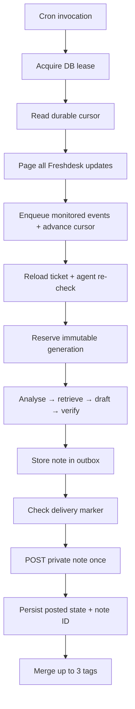

# Architecture

## Scope

Gate 1 has three systems only:

1. Freshdesk — trigger data, ticket context, KB retrieval, private note + tags.
2. Supabase Frankfurt — Edge Functions, Postgres state, review data, cron.
3. OpenAI — analyse, draft, verify, plus offline QA scoring.

The product is an agent coach. It writes a customer-ready draft only when the
answer is grounded; otherwise it gives verified facts and agent next steps.

## Live flow



The cursor advances only in the same database transaction that accepts queue
events. The generation reservation prevents two workers from generating the same
variant. The marker recovers an accepted Freshdesk POST after a lost response.

## Generation identity

A generation is unique by:

```text
ticket_id
+ trigger_message_id
+ prompt_version
+ model
+ run_variant
```

Generation payload becomes immutable after `reserved`. Human judgements live in
`suggestion_reviews`; compatibility fields on `suggestions` are a read projection.

## External writes

The only live external writes remain:

- one private Freshdesk note;
- one tag-set update on the same ticket.

No workflow writes a customer-facing reply.
